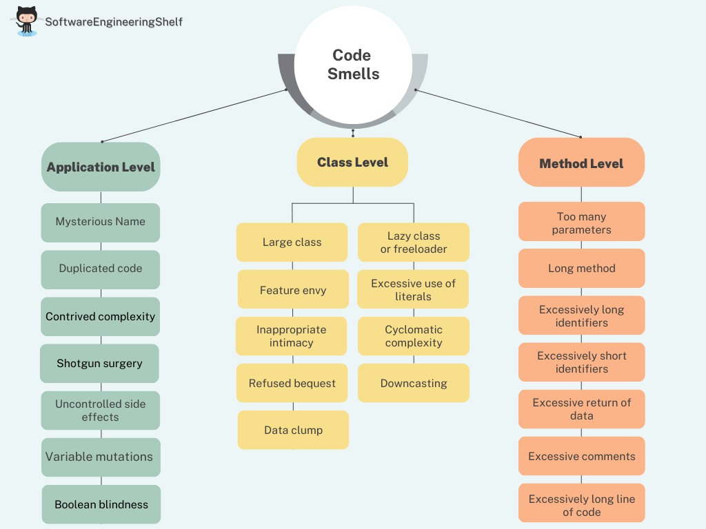

## __Languages__

- English

# Code Smells

## Image

## Detail
- __Application-level__ smells
  - __Large class__: a class that contains too many types or contains many unrelated methods
  - __Feature envy__: a class that uses methods of another class excessively.
  - __Inappropriate intimacy__: a class that has dependencies on implementation details of another class
  - __Refused bequest__: a class that overrides a method of a base class in such a way that the contract of the base class is not honored by the derived class
  - __Lazy class/freeloader__: a class that does too little.
  - __Excessive use of literals__: these should be coded as named constants, to improve readability and to avoid programming errors.
  - __Cyclomatic complexity__: too many branches or loops; this may indicate a function needs to be broken up into smaller functions, or that it has potential for simplification/refactoring.
  - __Downcasting__: a type cast which breaks the abstraction model; the abstraction may have to be refactored or eliminated.
  - __Orphan variable or constant class__: a class that typically has a collection of constants which belong elsewhere where those constants should be owned by one of the other member classes.
  - __Data clump__: Occurs when a group of variables are passed around together in various parts of the program

- __Class-level__ smells
  - __Large class__: a class that contains too many types or contains many unrelated methods
  - __Feature envy__: a class that uses methods of another class excessively.
  - __Inappropriate intimacy__: a class that has dependencies on implementation details of another class
  - __Refused bequest__: a class that overrides a method of a base class in such a way that the contract of the base class is not honored by the derived class
  - __Lazy class/freeloader__: a class that does too little.
  - __Excessive use of literals__: these should be coded as named constants, to improve readability and to avoid programming errors.
  - __Cyclomatic complexity__: too many branches or loops; this may indicate a function needs to be broken up into smaller functions, or that it has potential for simplification/refactoring.
  - __Downcasting__: a type cast which breaks the abstraction model; the abstraction may have to be refactored or eliminated.
  - __Orphan variable or constant class__: a class that typically has a collection of constants which belong elsewhere where those constants should be owned by one of the other member classes.
  - __Data clump__: Occurs when a group of variables are passed around together in various parts of the program. 

- __Method-level__ smells
  - __Too many parameters__: a long list of parameters is hard to read, and makes calling and testing the function complicated
  - __Long method__: a method, function, or procedure that has grown too large.
  - __Excessively long identifiers__: in particular, the use of naming conventions to provide disambiguation that should be implicit in the software architecture.
  - __Excessively short identifiers__: the name of a variable should reflect its function unless the function is obvious.
  - __Excessive return of data__: a function or method that returns more than what each of its callers needs.
  - __Excessive comments__: a class, function or method has irrelevant or trivial comments. A comment on an attribute setter/getter is a good example.
  - __Excessively long line of code (or God Line)__: A line of code which is too long, making the code difficult to read, understand, debug, refactor, or even identify possibilities of software reuse. 

## Sources 
- [WikiPedia](https://en.wikipedia.org/wiki/Code_smell)