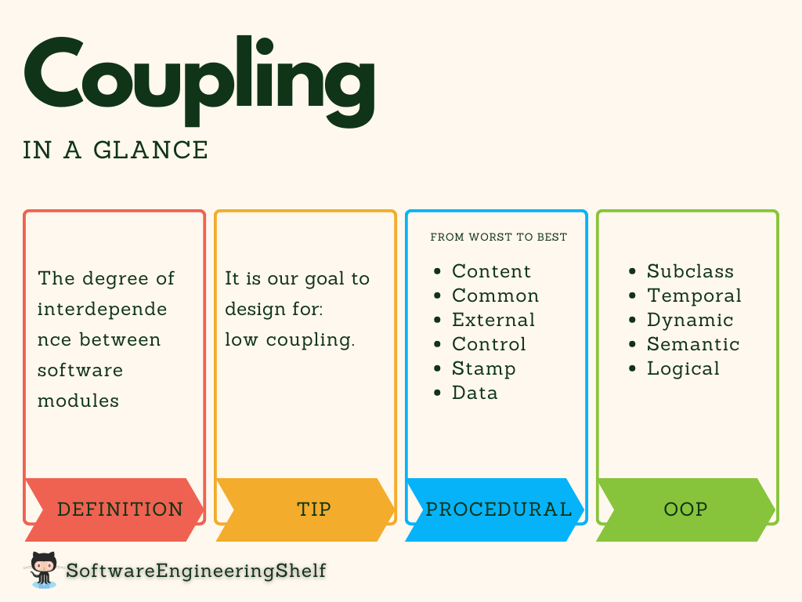

# Coupling
## Image

## Defination
The degree of __interdependence__ between software __modules__, a measure of how closely connected two routines or modules are, and the __strength__ of the relationships between modules.

__Tip : Low coupling should be a goal__

## Types
We could categorize __coupling__ into two different programming paradigms.

### Procedural
- __Content coupling__ (Worst) : Content coupling is said to occur when one module uses the code of another module, for instance, a branch.
- __Common coupling__ : Common coupling is said to occur when several modules have access to the same global data.
- __External coupling__ : External coupling occurs when two modules share an externally imposed data format, communication protocol, or device interface. 
- __Control coupling__ : Control coupling is one module controlling the flow of another, by passing information on what to do (e.g., passing a what-to-do flag).
- __Stamp coupling__ : Stamp coupling occurs when modules share a composite data structure and use only parts of it, possibly different parts.
- __Data coupling__ (Best): Data coupling occurs when modules share data through, for example, parameters. Each datum is an elementary piece, and these are the only data shared.
- 
### Object-Oriented
- __Subclass coupling__ : Describes the relationship between a child and its parent. 
- __Temporal coupling__ : It is when two actions are bundled together into one module just because they happen to occur at the same time.
- __Dynamic coupling__ : The goal of this type of coupling is to provide a run-time evaluation of a software system.
- __Semantic coupling__ : This kind of coupling considers the conceptual similarities between software entities using.
- __Logical coupling__ : Logical coupling (or evolutionary coupling or change coupling) exploits the release history of a software system to find change patterns among modules or classes

## Source
- [WikiPedia](https://en.wikipedia.org/wiki/Coupling_%28computer_programming%29)